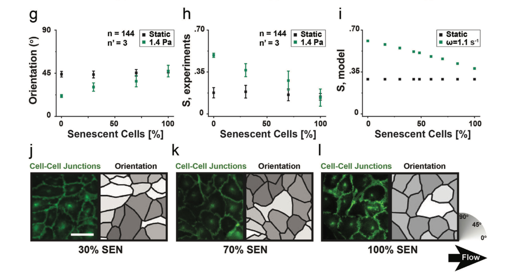

# External Referenced Papers

## Fluid shear stress sensing by the endothelial layer

| Vessel Type | Mean Shear Stress (Pa) | Peak Shear Stress (Pa) |
|-------------|------------------------|------------------------|
| Aorta | 1.2-1.4 | 2.5-3.6 |
| Large Arteries | 0.5-2.0 | Up to 4.0 |
| Arterioles | 2.0-6.0 | - |
| Capillaries | 1.0-4.0 | - |
| Venules | 0.1-1.0 | - |
| Large Veins | 0.1-0.6 | - |
| Vena Cava | 0.1-0.2 | - |
| Disturbed Flow Regions | 0.02-0.2 | - |
| HUVECs (experimental) | 0.4-1.6 | - |

HUVECs (Human Umbilical Vein Endothelial Cells) are theoretically classified under the category of Large Veins. HUVECs are derived from the endothelium of the umbilical vein, which is considered a large vein.

[^1]: Roux, E., Bougaran, P., Dufourcq, P., & Couffinhal, T. (2020). Fluid shear stress sensing by the endothelial layer. Frontiers in Physiology, 11, 861. https://doi.org/10.3389/fphys.2020.00861

## Safe Zones for shear stress
Expert recommendations on the assessment of wall shear stress in human coronary arteries: existing methodologies, technical considerations, and clinical applications
**7 Pa** is the safety zone for shear stress in the human coronary artery.

[^2]: Baeyens, N., & Schwartz, M. A. (2016). Biomechanics of vascular mechanosensation and remodeling. Molecular Biology of the Cell, 27(1), 7-11.

## The influence of surface micro-structure on endothelialization under supraphysiological wall shear stress

At physiological WSS levels,
optimal endothelialization was obtained independently from surface topography. However, at higher
WSS levels, only monolayers grown on appropriately micro-structured surfaces preserved optimal
integrity. Under these ow conditions, endothelial cells polarized by the contact with the micro-structure
and, interestingly, oriented themselves in the direction perpendicular to ow.

Monolayer integrity is possible up until 6 Pa in gratings or 4 Pa in flat structures.

Maximum cell density is at 4 Pa in flat structures.
Pre-conditioning can be useful to have a higher Pressure as alighnemt could also be higher at 5 Pa.

[^3] Robotti, F., Franco, D., Bänninger, L., Wyler, J., Starck, C. T., Falk, V., ... & Ferrari, A. (2014). The influence of surface micro-structure on endothelialization under supraphysiological wall shear stress. Biomaterials, 35(30), 8479-8486. 

## A free-form patterning method enabling endothelialization under dynamic flow

Endothelial Cell Response to Wall Shear Stress (WSS)

Under Normal Flow Conditions (WSS < 6 Pascals)
1. The endothelial cells gradually stretch out (elongate)
2. They align themselves parallel to the direction of blood flow
3. This alignment helps reduce resistance and allows for efficient blood flow

Under High Flow Conditions (WSS > 6 Pascals)
1. The cells change their orientation dramatically
2. Instead of aligning with the flow, they rotate to position themselves perpendicular (at a 90-degree angle) to the flow direction
3. This is likely a protective response to reduce the mechanical stress on the cells

Cell Polarity :Regardless of how the cells orient themselves physically, their internal polarity (the positioning of cellular components like the Golgi apparatus relative to the nucleus) continues to align with the flow direction. This suggests the cells maintain their ability to sense flow direction even when they change their physical orientation.

BF can increase cell density by a lot, and meaasures tend to be with lower variance

8 Pa for 12h and then 1.4 Pa can destroy the connectinvity of the monolayer

VE-cadherin phosphorylation were high in resting conditions (Fig. 6a) and were
not significantly increased by the exposure to flow (WSS of 1.4Pa). 
Steady levels of VE-cadherin phosphorylation correlated
with limited cell orientation

## Bistability of Dielectrically Anisotropic Nematic Crystals and the Adaptation of Endothelial Collectives to Stress Fields

Coherent cell polarity was established within 2–4 hours, while cell shape changes and collective alignment progressed more slowly, stabilizing after 6–8 hours. Under low wall shear stress (WSS, 1.4 Pa), cells elongated along the flow direction, whereas high WSS (8 Pa) induced faster remodeling, leading to perpendicular alignment. Despite these differences in orientation, both states maintained consistent planar cell polarity, with the Golgi positioned upstream of the nucleus, demonstrating robust organization under varying flow conditions

It's possible to measure the relative strain energy given by the system, so that you can measure the speed of response of it. In this way, it may be interesting to understand the behaviour. T = 8h/7h.
So the maximum is after 4h. 

Senescent endothelial cells fail to change shape in response to flow and generate monolayers where the cell aspect ratio
is unaffected, while the cell orientation remains randomly distributed despite the exposure to WSS

The model prediction was experimentally verified exposing endothelial monolayers, featuring precisely controlled ratios of young and senescent cells, to flow generating a WSS of 1.4 Pa. The average cell orientation along the direction of
flow was gradually lost in monolayers featuring 0, 30, 70, and 100% of senescent endothelial cells (≈21°,31°,37°,and47°,respectively).

Senescence reduces angle of change on a linear model.

## The nucleus of endothelial cell as a sensor of blood flow direction

Think of it like a spring system - the actomyosin cytoskeleton provides tension that both:
- Resists immediate changes (like a shock absorber)
- Helps transmit forces throughout the cell (like a network of connected springs)

ACTIN'S ROLE IN ENDOTHELIAL CELL MECHANOTRANSDUCTION

KEY FUNCTIONS
Acts as a mechanical resistor against nuclear movement
Transmits forces throughout the cell
Connects the nuclear envelope to cell-cell adhesions
Controls cellular sensitivity to flow changes

FLOW ADAPTATION SCENARIO (1 Pa to 3.5 Pa)

TOO MUCH ACTIN
Creates excessive resistance to nuclear movement
Prevents proper cell polarization
Reduces adaptability to increased shear stress
Makes cells too rigid to respond to flow changes

TOO LITTLE ACTIN
Allows uncontrolled nuclear movement
Risks cell membrane rupture under high shear
Compromises mechanical force transmission
May lead to cell damage

OPTIMAL BALANCE
Provides sufficient structural support
Allows controlled nuclear movement
Enables gradual adaptation to flow changes
Maintains cell integrity while permitting necessary responses

ANALOGY
Think of actin like a car's suspension system:
Too stiff: Car can't absorb bumps (cell can't adapt to flow changes)
Too loose: Car becomes unstable (cell risks damage)
Just right: Balances stability with adaptability

This balance is crucial for endothelial cells to maintain both structural integrity and mechanical responsiveness under varying flow conditions.

NUCLEAR POSITION UNDER FLOW

GENERAL BEHAVIOR
The nucleus moves downstream in response to flow
Creates a bulge on the cell's apical surface
Movement is controlled and limited
Acts as a mechanosensor for flow direction

CONTROL MECHANISMS
Actomyosin cytoskeleton resists movement
Nuclear envelope connects to actin network
Dynamic but maintained connections prevent excessive movement
Natural "braking" system limits displacement

If you would like to have an example of how the system would evolve, you can find a nice animation here. However, with the time there should be a process of actin production based on the condition of shear stress
[endothelial-flow-response.tsx](..%2F..%2Fdocs%2Ffigures%2Fendothelial-flow-response.tsx)

Consider that there may not be a proper threashold 

## Mechanism of endothelial cell shape change and cytoskeletal remodeling in response to fluid shear stress

Based on the biomechanical principles described in the paper and general cell mechanics, this time asymmetry would likely be present in both scenarios (X to 0 and X to X/2), but for different reasons:

From X to 0 (Complete halt):

Requires complete reorganization of cytoskeletal structures
Must fully disassemble flow-aligned stress fibers
Needs to rebuild original focal adhesion patterns
Has no mechanical guidance for reorganization

From X to X/2 (Partial reduction):

Still maintains directional mechanical cues
Keeps some aligned structures but needs remodeling
Must adjust to new force equilibrium
Has continuous mechanical guidance

The paper doesn't directly test different magnitudes of flow reduction, but based on the mechanisms described (particularly regarding focal adhesions and cytoskeletal remodeling), there would likely still be an asymmetry even in X to X/2 transitions 

Looking at Figure 3B in the paper, I can analyze the β-actin mRNA production response:

Response Characteristics:

The curves show an initial rapid increase
They then approach a steady state level
The response appears to have exponential-like behavior
Different magnitudes (15, 25, 45 dyn/cm²) show similar response patterns but different final values

First Order System Comparison:

The response does resemble a first-order step response system which would follow the form:
y(t) = A(1 - e^(-t/τ))
Key characteristics present:

No overshoot
Smooth approach to steady state
Initial rapid rise followed by decreasing rate of change

Evidence from Data:

The 25 dyn/cm² curve shows classic first-order behavior
The 45 dyn/cm² curve also follows this pattern but with a higher gain
The 15 dyn/cm² shows minimal response, suggesting a threshold effect

This behavior is consistent with a first-order system, though with some biological complexity added. The time constant (τ) appears to be around 2-3 hours based on when the curves reach approximately 63% of their final value

In this case you could also consider a maximum actin production rate as a possibility

For the treshold, it may be a resolution treashold for cells.

## Shear Stress Regulates Forward and Reverse Planar Cell Polarity of Vascular Endothelium In Vivo and In Vitro

Postconfluent endothelial cells elongated in the direction of  shear stress within 24 hours, with mean cell length in the  shear direction becoming 2.5 to 3 times cell width

The study focuses on 1.5 Pa as a shear stress value.

Importance of microtubules for cell elongation (). These
findings indicate an obligate role for dynamic instability of
microtubules in the shear stress–induced motility of endothe-
lial cells.)

## Endothelial cell sensing of flow direction

Oscillatory regime is not an optimal condition for endothelial health - it caused:
- Increased ROS production
- Higher NF-κB activation (inflammatory response)
- Lower NO production
- Reduced eNOS activation

Regions of arteries under low and disturbed fluid shear stress are susceptible to
atherosclerosis, whereas regions under high laminar flow are atherosclerosis-resistant.
Susceptibility to atherosclerosis strongly correlates with poor endothelial alignment. In
vitro, inflammatory flow profiles also fail to induce cell alignment. The current study
demonstrates that signals stimulated by flow are determined by direction relative to the
axis defined by cell shape and the cytoskeleton. Thus, flow parallel to the cell axis
preferentially stimulates eNOS activation and NO production, whereas perpendicular
flow preferentially stimulates reactive oxygen and NF-kB activation. Thus, the same flow
activates functionally opposite pathways depending on direction. These data
fundamentally alter our understanding of how flow acts upon the endothelium and
provide a direct causal link between cell alignment and inflammatory activation.

## In vivo modulation of endothelial polarization by Apelin receptor signalling

The alignment of ECs in the direction of flow requires the sensing of
mechanical shear stress and the conversion of these stimuli to
biochemical signals that mediate cytoskeletal remodelling.
A number of mechanosensitive molecules have been identified
including mechanically gated channels5–8, mechanosensitive
receptors9–11, G-protein-coupled receptors (GPCRs)12–16
,
G-proteins16–19, mechanosensitive enzymes20 and cilia

## Microvascular Endothelial Cells Migrate Upstream and Align Against the Shear Stress Field Created by Impinging Flow

Multiple cell types have different values for the way they would rotate and evolve based on the shear stress.

## Cooperative Effects of Matrix Stiffness and Fluid Shear Stress on Endothelial Cell Behavior

Evidence is now emerging that
changes in vessel stiffness that occur with age, metabolic
disorders, and atherosclerosis can promote an atheroscle-
rotic phenotype in the cells within the vessel wall (6–9).
Increased matrix stiffness from 2.5 to 10 kPa (mimicking
age-related stiffening of the EC matrix) induces increased
endothelium permeability and leukocyte transmigration,
both of which are hallmarks of atherosclerosis progression

Laminar arterial-level shear stress (10–30 dyn/cm2) is
associated with an atheroprotective EC phenotype and causes
ECs to align and elongate in the flow direction

## Mechanotransduction and endothelial cell homeostasis: the wisdom of the cell

The results, together with the data in the literature, have led to the formulation of the
hypothesis that the feedback control of intracellular mechanics
and signaling in response to the externally imposed stresses
serves to maintain homeostasis at the cellular level, which is
required for normal endothelial functions and protection
against pathophysiological changes such as atherosclerosis.

## A mechanosensory complex that mediates the endothelial cell response to fluid shear stress

Fluid shear stress triggers the conformational activation of integ-
rins, which mediates both the alignment of endothelial cells in
laminar shear and the activation of NF-kB in response to changes
in shear2–4. We have identified a mechanosensory complex comprised
of PECAM-1 (which activates Src), VE-cadherin (which functions as
an adaptor) and VEGFR2 (which activates PI(3)K). PI(3)K most
probably leads to integrin activation through a conserved pathway
shared with other cell types

There's a mention that mechanical forces can increase actin production by 20% in "healthy" cells

Here there is the fold induction over control together with a differnce with time (early moments)

## The Molecular Organization of Endothelial Cell to Cell Junctions: Differential Association of Plakoglobin,/3-catenin, and ot-catenin with Vascular Endothelial Cadherin (VE-cadherin)

VE-cadherin, ot-catenin, and /3-catenin are already associated with each other at
early stages of intercellular adhesion and become
readily organized at nascent cell contacts.

There was a paper sharing that 3.5 Pa could be an ideal value for cells.